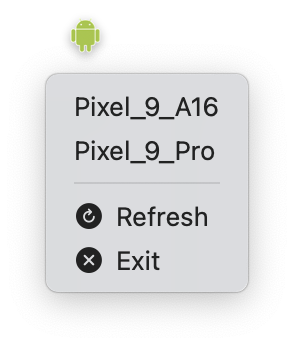

# AVD-Launcher

A macOS app that allow you to run your Android Emulator with just one click

## Problem

If you want to run your Android Emulator you have to run it from the CLI or using Android Studio.

## Solution

If you want to check something quickly you may just want to run one of them with a single click. It's just the job of AVD-Laucher. It's a wrapper for AVD.

## Menu Bar Menu



## Installation

### Building from Source
1. Clone this repository
2. Open `AVD Launcher.xcodeproj` in Xcode
3. Build and run the project

### Download Pre-Built App
- Download the latest release from the releases page

## Usage

### Menu Bar Icon
- Shows every Android Emulator created
- If there is no Android Emulator, it will display "No device" instead of the Emulators
- If AVD is not install, it will display "Can't find 'emulator' tool." instead of the Emulators. (Default location is on `$HOME/Library/Android/sdk/emulator/`)

## Privacy & Security

AVD-Launcher:
- Does not collect or transmit any personal data. none.
- Runs entirely locally on your machine
- Source code is open and auditable

## Development

### Building from Source
```bash
git clone https://github.com/yourusername/AVD-Launcher.git
cd AVD\ Launcher
open AVD\ Launcher.xcodeproj
```

### Contributing
1. Fork the repository
2. Create a feature branch
3. Make your changes
4. Submit a pull request

## License

MIT License - see LICENSE file for details.

## Support

For issues, feature requests, or questions:
- Open an issue on GitHub
- Provide system information (macOS version, setup)
- Include steps to reproduce any problems
- Check the troubleshooting section above first